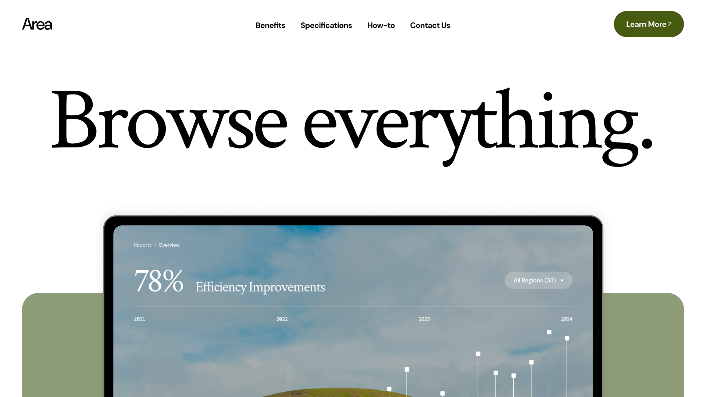

  <h3>Area (Modern Product Launch)</h3>
  <i>Browse everything</i>

 

  

 

---

### Overview

A modern responsive landing page focused on:

- Editorial-inspired responsive layout system
- Strong typography-driven visual hierarchy
- Minimal and premium UI aesthetic

Built with:

  
  
  
  
  
  

### Preview

Check out the [live version](https://area-ecru.vercel.app) or explore the original [Figma design](https://www.figma.com/community/file/1487309170684591074/modern-product-launch)
